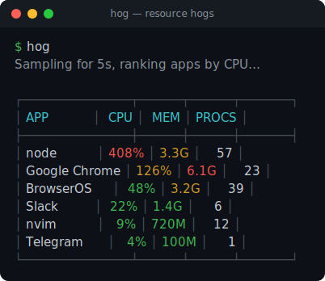

<div align="center">

# hog

**See what's actually hogging your Mac — and kill it.**

*Sample a few seconds, fold every app's processes into one line, take out the hog.*



</div>

`hog` samples the process table over a few seconds, groups each app's many processes into a single line, and ranks them by CPU or memory — color-coded by how big a share of your machine they're really using. When you spot the culprit, `hog kill <app>` takes out the whole group.

- **Grouped by app** — Chrome's 20 helpers and Electron's swarm collapse into one row, so you see the *app* eating your machine, not 40 anonymous processes
- **Sampled, not a snapshot** — averages CPU over 5–30s, so you catch the real hog instead of a one-frame blip
- **Color-coded by impact** — green / yellow / red by the share of your Mac an app is actually using
- **One-shot kill** — `hog kill chrome` terminates the whole group: `SIGTERM`, then `SIGKILL` for stragglers
- **CPU or memory** — rank by either; `-m` flips it
- **Zero config, one binary** — no daemon, no setup; shells out to `ps`, nothing left running

---

## Install

Requires Go 1.24+ and macOS.

```sh
cd hog
make install   # builds ./hog and copies it to ~/bin, codesigned
```

No config file, nothing to set up — `hog` reads the live process table on each run.

## Quick Start

```sh
hog            # sample 5s, rank apps by CPU
hog -d 15      # sample longer for a steadier signal
hog -m         # rank by memory instead
hog kill node  # terminate every process in the "node" group
```

## How It Works

`hog` takes two snapshots of the process table `--duration` seconds apart and computes each process's CPU usage *over that window* — real usage during the sample, not the lifetime average `ps` reports by default. It then folds processes into apps by their owning macOS `.app` bundle (a Chrome helper buried five frameworks deep still lands under **Google Chrome**), falling back to the executable name for plain CLI tools and daemons.

CPU% is summed across an app's processes, so **100% ≈ one full core** and a busy multi-core app reads above 100%.

## Commands

### Report (default)

```sh
hog                 # top 20 apps by CPU, sampled over 5s
hog -d 30           # 30-second window
hog -m              # rank by resident memory
hog -n 10           # show only the top 10 (0 = all)
hog -m -n 5         # the 5 biggest memory users
```

| Flag | Default | Meaning |
| --- | --- | --- |
| `-d`, `--duration` | `5` | Sampling window in seconds (min 1; 5–30 gives a steadier read) |
| `-m`, `--mem` | off | Rank by memory instead of CPU |
| `-n`, `--limit` | `20` | Show at most N apps (`0` = all) |

### Kill

```sh
hog kill chrome     # match is a case-insensitive substring of the app name
hog kill node -f    # -f skips the confirmation prompt
```

`kill` finds every app whose name contains the pattern, shows how many processes it will terminate, and asks before acting (unless `-f`). It sends `SIGTERM` first, waits a short grace, then `SIGKILL`s anything still alive.

> Note: `hog kill <app>` targets the **whole group** — `hog kill node` hits every `node` process at once. The prompt shows the count before it acts.

## Color

Color reflects an app's share of *total machine capacity*, not a raw number — so it answers "is this slowing my Mac?" rather than "is this process busy?"

| Color | Share of machine | Read as |
| --- | --- | --- |
| 🟢 green | < 10% | minor |
| 🟡 yellow | 10–30% | noticeable |
| 🔴 red | > 30% | hogging |

CPU share is the app's summed CPU% ÷ (cores × 100%); memory share is its resident size ÷ physical RAM. The table is sorted by usage regardless of color, so the top rows are always the suspects. Thresholds live in [`internal/render/render.go`](internal/render/render.go).

---

> Personal tool built for my own workflow. Feel free to fork and adapt.
