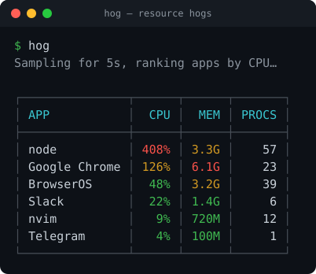

<div align="center">

# 🐷 hog

**See what's actually hogging your Mac — and kill it.**

*Sample a few seconds, fold every app's processes into one line, take out the hog.*



</div>

`hog` samples the process table over a few seconds, groups each app's many processes into a single line, and ranks them by CPU or memory — color-coded by how big a share of your machine they're really using. Spot the culprit, drill into it with `hog details <app>`, and take out the whole group with `hog kill <app>` — or `hog details <app> -k` to `fzf`-pick just the runaway processes.

- **Grouped by app** — Chrome's 20 helpers and Electron's swarm collapse into one row, so you see the *app* eating your machine, not 40 anonymous processes
- **Real memory, not RSS** — reads each process's kernel footprint, so the dormant 7 GB language server that `ps` reports as 0 KB can't hide
- **Sampled, not a snapshot** — averages CPU over 5–30s, so you catch the real hog instead of a one-frame blip
- **Reap the dead weight** — `hog reap` finds processes that are old, dormant, and still holding memory, and shows what killing them would free before it kills anything
- **One-shot verdict** — `hog health` weighs swap, memory, paging, CPU and disk over a window and tells you which subsystem is actually the bottleneck
- **Color-coded by impact** — green / yellow / red by the share of your Mac an app is actually using
- **Drill in** — `hog details <app>` lists an app's processes with their real command lines, so you can tell the runaway dev server from the idle language servers
- **Whole-group or surgical kill** — `hog kill chrome` ends the whole group; `hog details node -k` opens an `fzf` multi-select to kill just the offenders. Both `SIGTERM`, then `SIGKILL` for stragglers
- **CPU or memory** — rank by either; `-m` flips it
- **One binary, no daemon** — reads the live process table on each run and leaves nothing behind; only `reap` keeps a config file, for its probes

---

## Install

Requires Go 1.24+ and macOS.

```sh
cd hog
make install   # builds ./hog and copies it to ~/bin, codesigned
```

Nothing to set up: `hog` reads the live process table on each run. `hog reap` writes
`~/.config/hog/reap.yaml` the first time it runs, with its defaults and probes commented inline.

## Quick Start

```sh
hog            # sample 5s, rank apps by CPU
hog -d 15      # sample longer for a steadier signal
hog -m         # rank by memory instead
hog details        # fzf-pick one or more app groups to inspect
hog details node     # list the processes inside the "node" group
hog details -k       # fzf-pick app group(s), then process(es) to kill
hog kill node  # terminate every process in the "node" group
hog kill       # fzf-pick one or more app groups to terminate
hog reap       # dry run: what's old, dormant, and big — and what killing it frees
hog reap -x    # actually reap it
hog reap -i    # fzf-pick from the candidates
hog health     # 15s check: is this machine in trouble, and which part?
```

## How It Works

`hog` takes two snapshots of the process table `--duration` seconds apart and computes each process's CPU usage *over that window* — real usage during the sample, not the lifetime average `ps` reports by default. It then folds processes into apps by their owning macOS `.app` bundle (a Chrome helper buried five frameworks deep still lands under **Google Chrome**), falling back to the executable name for plain CLI tools and daemons.

### Why not RSS

Memory comes from the kernel's `phys_footprint` (via `proc_pid_rusage`), the same number Activity Monitor shows — **not** `ps`'s RSS.

This matters more than it sounds. macOS compresses idle pages and swaps them out, and RSS counts only what is resident in RAM. A language server that indexed a large project two days ago and then went quiet holds gigabytes against your memory ceiling while `ps -o rss=` reports **0 KB** for it. Ranking by RSS therefore hides precisely the processes worth finding: on the machine this was built for, `ps` put a 76 GB pile of `rust-analyzer` processes at 2.17 GB, ninth on the list.

The kernel refuses `proc_pid_rusage` for processes owned by other users, so system daemons fall back to their RSS for display — and are never reap candidates, which is exactly the right boundary.

CPU% is summed across an app's processes, so **100% ≈ one full core** and a busy multi-core app reads above 100%.

## Commands

### Report (default)

```sh
hog                 # top 20 apps by CPU, sampled over 5s
hog -d 30           # 30-second window
hog -m              # rank by memory footprint
hog -n 10           # show only the top 10 (0 = all)
hog -m -n 5         # the 5 biggest memory users
```

| Flag | Default | Meaning |
| --- | --- | --- |
| `-d`, `--duration` | `5` | Sampling window in seconds (min 1; 5–30 gives a steadier read) |
| `-m`, `--mem` | off | Rank by memory footprint instead of CPU |
| `-n`, `--limit` | `20` | Show at most N apps (`0` = all) |

### Details

```sh
hog details            # fzf-pick one or more app groups
hog details node       # list every process in the "node" group, busiest first
hog details chrome     # aliases: `detail`, `show`
hog details node -k    # pick processes in an fzf multi-select and kill them
hog details -k         # fzf-pick app group(s), then process(es) to kill
```

Drills into one app: every member process with its PID, CPU%, memory, and full
command line — so you can tell *which* of node's 60 processes is the actual hog
(a runaway dev server) versus the idle ones (language servers). Accepts `-d` to
set the sampling window, same as the report.

If `<app>` is omitted, `details` opens an `fzf` multi-select picker of sampled
app groups. Select one or more groups to render their process details.

With `-k`/`--kill`, instead of printing a table it opens an `fzf` picker of those
processes — sorted by CPU, showing CPU% and memory — where you `Tab` to select the
expensive ones and `Enter` to kill them (`SIGTERM`, then `SIGKILL`). This is how you
surgically take out, say, four runaway `node` servers without touching the idle
language servers in the same group. If `<app>` is omitted, `details -k` first
asks you to pick the app group(s), then opens the process picker. Requires
[`fzf`](https://github.com/junegunn/fzf).

### Kill

```sh
hog kill            # fzf-pick one or more app groups
hog kill chrome     # match is a case-insensitive substring of the app name
hog kill node -f    # -f skips the confirmation prompt
```

`kill` finds every app whose name contains the pattern, shows how many processes it will terminate, and asks before acting (unless `-f`). It sends `SIGTERM` first, waits a short grace, then `SIGKILL`s anything still alive.

If `<app>` is omitted, `kill` opens an `fzf` multi-select picker of app groups
sorted by memory, then uses the same confirmation and termination flow for the
selected groups.

> Note: `hog kill <app>` targets the **whole group** — `hog kill node` hits every `node` process at once. The prompt shows the count before it acts. For a narrower sweep driven by measurements rather than a name, use `hog reap`.

### Reap

```sh
hog reap                              # dry run — the default; kills nothing
hog reap --older 2d --duty 0.5        # stricter: older than 2 days, under 0.5% duty
hog reap --min-mem 1G                 # only things big enough to be worth it
hog reap -i                           # fzf-pick from the candidates
hog reap -x                           # execute
hog reap --tree                       # take descendants along with their parent
hog reap --all                        # list every candidate, not just the top 25
```

`reap` finds the processes that quietly accumulate over days of uptime — language
servers, MCP servers, editor helpers — which are old, have spent almost none of
that time on CPU, and are still holding significant memory.

It is agnostic about what a process *is*. Selection rests on four measured
properties, ANDed together:

| Predicate | Flag | Why it isn't enough alone |
| --- | --- | --- |
| Age | `--older` | A terminal open for a week is old and perfectly healthy |
| Duty cycle — lifetime CPU ÷ wall clock | `--duty` | An idle daemon using 2 MB costs nothing |
| Idle right now | `--max-cpu` | Everything looks idle inside a 5-second window |
| Footprint | `--min-mem` | A busy process can be large and still be doing its job |

Duty cycle is the signal that separates dormant from merely quiet: a language
server that indexed once and then slept sits near **0.2%**, while an interactive
process stays above **1%**.

Two safety rules are structural rather than configurable. Only processes with
readable kernel accounting are eligible — which is exactly your own processes,
so no system daemon can be reaped and there is no blocklist to maintain. And
`reap` never targets itself or its ancestors, so it cannot kill the shell,
terminal, or multiplexer it is running inside.

### Probes

Some processes hold state that no measurement can see. An editor with an unsaved
buffer looks identical to one without: same age, same memory, same duty cycle.
Signals cannot tell them apart — so `reap` asks.

A probe is a command that answers *"is this safe to kill?"* for matching
processes:

```yaml
probes:
  - match: nvim
    label: unsaved buffers
    on_unknown: protect
    ask: |
      # exit 0 = safe    exit 2 = could not tell    anything else = protect
      ...
```

`hog` knows nothing about any specific program — it only substitutes `{pid}`,
runs the command, and reads the exit status. The shipped `nvim` rule is an
example of the mechanism living in config, not a special case in the code; copy
the pattern for anything else that owns unsaved state.

This matters for Neovim specifically: it traps `SIGTERM` as a *deadly signal*
and exits without prompting, and with `swapfile` off there is no recovery file
either. The probe asks it over RPC how many modified buffers it has and only
reaps it when the answer is zero.

Probes can only ever *protect* — they never promote a process the predicates
rejected. Anything spared is reported, so protection is visible rather than a
silently smaller total.

Config lives at `~/.config/hog/reap.yaml`, written with commented defaults on
first run.

### Health

```sh
hog health           # 15-second window
hog health -d 30     # longer window for a steadier read
```

Scores eight dimensions and combines them into one verdict:

```
⚠  DEGRADED — 72/100

┌─────────────────┬───────┬────────────┬─────────────────────────────────────────────┐
│ CHECK           │ SCORE │            │ DETAIL                                      │
├─────────────────┼───────┼────────────┼─────────────────────────────────────────────┤
│ swap headroom   │    11 │ █········· │ 16.1G of 17.0G used — 938M free             │
│ swap activity   │    97 │ ██████████ │ 21 pages/s to and from swap                 │
│ memory pressure │   100 │ ██████████ │ 92.9G available of 128.0G · 2.8G compressed │
│ reclaimable     │    53 │ █████····· │ 39.0G held by 17 dormant process(es)        │
│ kernel time     │   100 │ ██████████ │ 8% system, 20% busy overall                 │
│ cpu load        │   100 │ ██████████ │ 7.1 on 16 cores (0.44 per core)             │
│ process count   │    52 │ █████····· │ 1507 processes, 8331 threads                │
│ disk headroom   │    49 │ █████····· │ 404.5G free of 3721.9G (89% used)           │
└─────────────────┴───────┴────────────┴─────────────────────────────────────────────┘

swap headroom is the bottleneck: 16.1G of 17.0G used — 938M free
→ free memory now — at zero, macOS starts force-killing applications
→ hog reap would free 39.0G across 17 process(es)
```

| Check | Weight | What it catches |
| --- | --- | --- |
| swap headroom | 3 | How close swap is to exhaustion, where macOS starts force-killing apps |
| swap activity | 3 | Paging **during the window** — thrashing now, not last Tuesday |
| memory pressure | 3 | Available memory, with the kernel's own pressure level setting severity |
| reclaimable | 2 | Memory held by dormant processes — measured with `hog reap`'s own selection |
| kernel time | 2 | System-time share; high sys on an idle machine means the VM subsystem is drowning |
| cpu load | 2 | Run queue against core count |
| process count | 1 | Accumulation (weak signal, weighted accordingly) |
| disk headroom | 1 | Free space — swap files cannot grow on a full disk |

**Why a window.** Swap and paging counters are cumulative since boot. A single
reading cannot tell a machine thrashing right now from one that thrashed days
ago; only the change across an interval can. Fifteen seconds is long enough for
a stable rate and short enough to wait for.

**The score never hides a failure.** A machine one gigabyte from swap
exhaustion is in serious trouble however healthy its CPU and disk look, so any
critical check caps the verdict regardless of the weighted average, two
criticals force `UNHEALTHY`, and the output leads with the responsible
subsystem rather than the number.

## Color

Color reflects an app's share of *total machine capacity*, not a raw number — so it answers "is this slowing my Mac?" rather than "is this process busy?"

| Color | Share of machine | Read as |
| --- | --- | --- |
| 🟢 green | < 10% | minor |
| 🟡 yellow | 10–30% | noticeable |
| 🔴 red | > 30% | hogging |

CPU share is the app's summed CPU% ÷ (cores × 100%); memory share is its footprint ÷ physical RAM. The table is sorted by usage regardless of color, so the top rows are always the suspects. Thresholds live in [`internal/render/render.go`](internal/render/render.go).

---

> Personal tool built for my own workflow. Feel free to fork and adapt.
